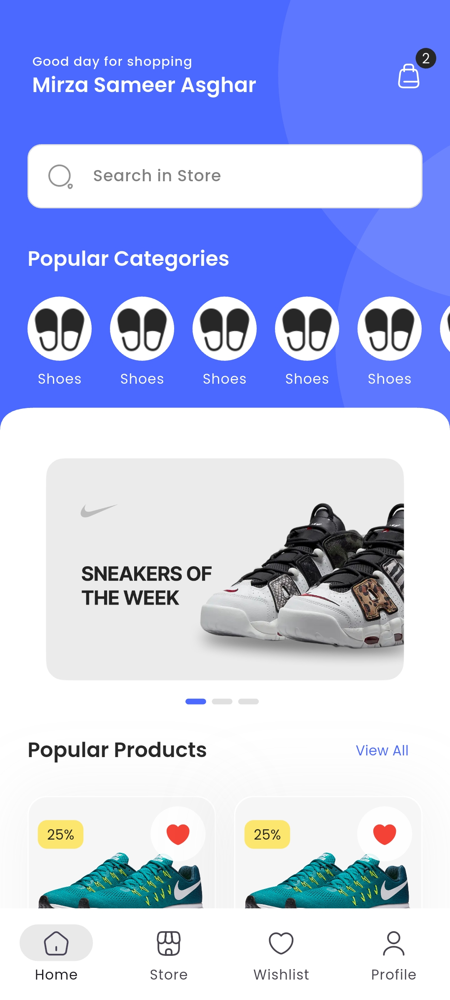
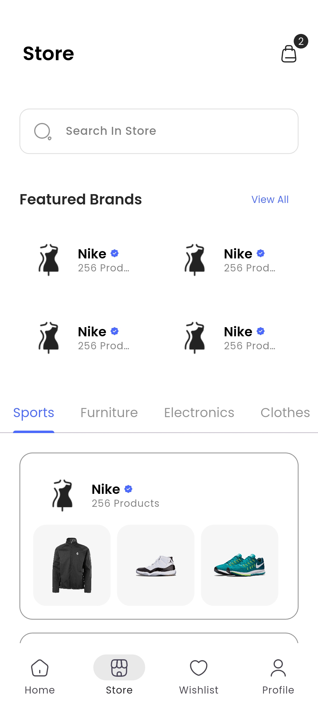
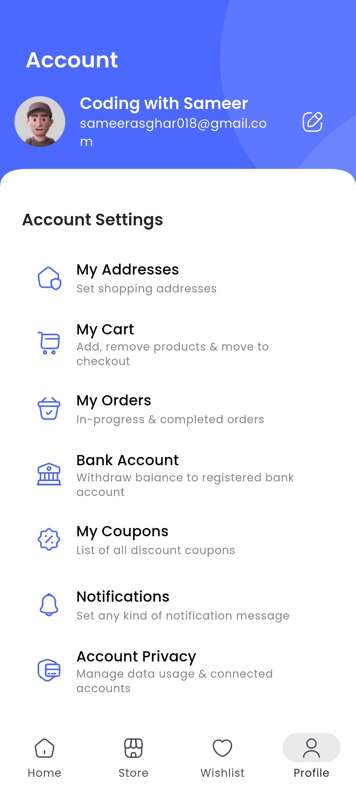

# 🛒 E-Commerce App – Flutter | Clean Architecture

A modern E-Commerce Mobile Application built using Flutter, designed with a clean and scalable architecture.
This app allows users to browse products, view details, manage a shopping cart, and simulate an online shopping experience with a smooth and responsive UI.

The project focuses on clean code practices, modular structure, state management, and real-world app flow, making it ideal for learning and production-level Flutter development.

## ✨ Key Highlights

• 🧩 Clean & scalable architecture
• 🛍️ Product listing & product details
• 🛒 Cart management (Add / Remove / Update items)
• 🧠 State management for reactive UI
• 📱 Fully responsive UI
• ⚠️ Loading states & error handling
• 🚀 Optimized performance & smooth navigation

---

## 📸 Screenshots

  
  
  
  

---

(Update image paths according to your project)

## 🚀 Tech Stack Used

🧰 Flutter – Cross-platform UI toolkit (Android & iOS)

📦 Dart – Programming language for Flutter

🧠 State Management – Provider / Bloc / Riverpod (based on implementation)

🧱 Clean Architecture – Separation of UI, business logic & data layers

🌐 API / Backend Ready – Supports REST API or Firebase integration

📱 Responsive UI – Adapts to different screen sizes

🔄 Error Handling & Loading States – Improved user experience

📱 Platform Support – Android & iOS

## 💡 Project Inspiration

This project is inspired by real-world e-commerce applications like Amazon, Daraz, and Shopify, focusing on how large-scale apps manage UI, state, and data flow.

The goal of building this app was to practice scalable Flutter architecture, improve state management skills, and understand production-ready app structure.

## 🧑‍💻 Author

Mirza Sameer Asghar
Flutter Developer & Learner
